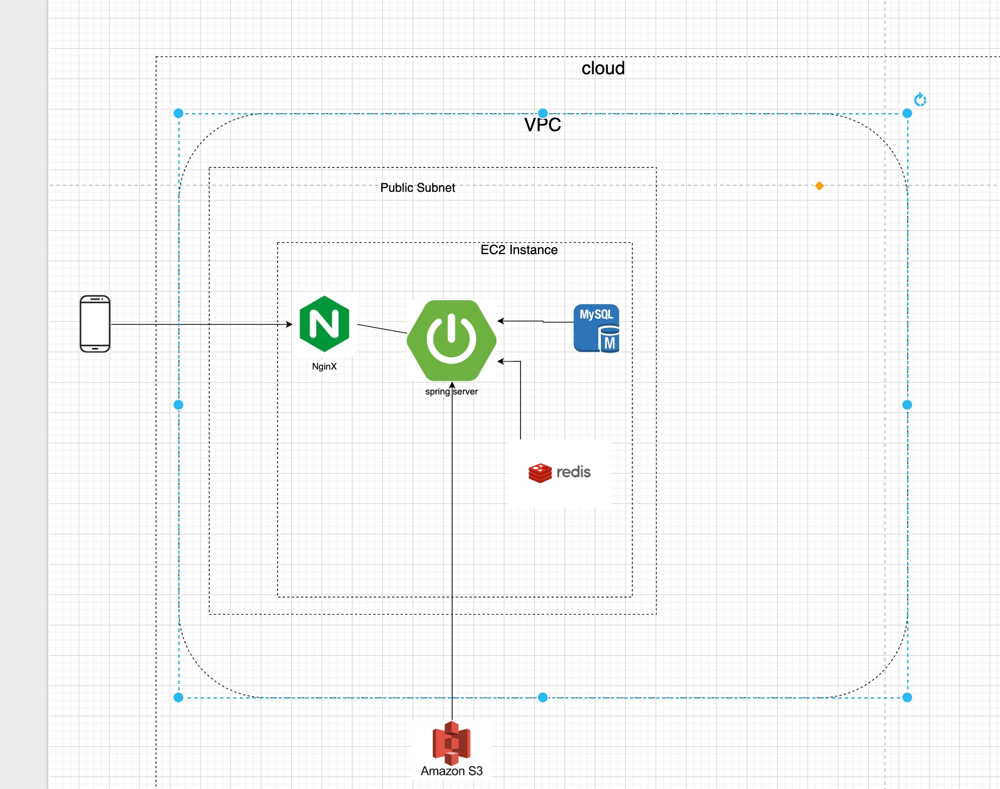
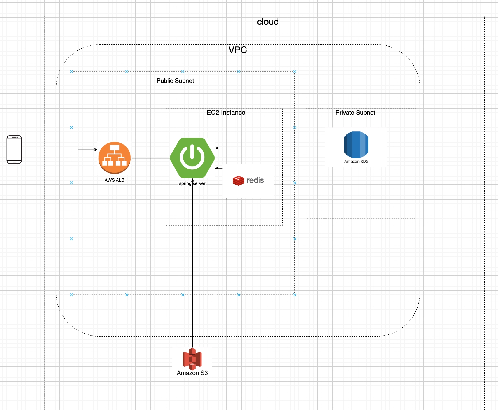
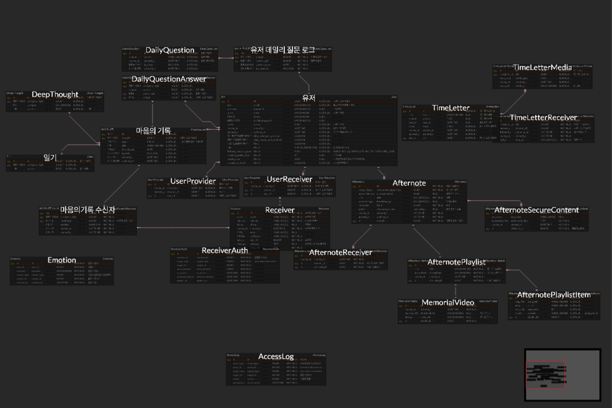

# AfterNote-Server

> 마지막 순간의 온기를 전하다 - 애프터노트는 사후에 전달되는 편지 서비스입니다.

AfterNote 프로젝트의 백엔드 서버입니다.

## 📊 목차

- [기술 스택](#-기술-스택)
- [시스템 아키텍처](#-시스템-아키텍처)
- [ERD (Entity Relationship Diagram)](#-erd)
- [프로젝트 구조](#-프로젝트-구조)
- [시작하기](#-시작하기)

---

## 🛠️ 기술 스택

- Backend: Java 17, Spring Boot 3.2.1
- ORM: Spring Data JPA, Hibernate 6.4.1
- Database: MySQL 8.0
- Authentication: JWT, Spring Security
- External APIs: Google Gemini, AWS S3
- Encryption: ChaCha20-Poly1305 (모바일 최적화)
- Build Tool: Gradle 8.12
- Containerization: Docker, Docker Compose
- Testing: JUnit 5, Mockito

---

## 🏗️ 시스템 아키텍처

### 현재 구조



#### 아키텍처 선택 이유

| 컴포넌트                        | 선택 이유                                                                                         |
| ------------------------------- | ------------------------------------------------------------------------------------------------- |
| **VPC (Virtual Private Cloud)** | 보안이 필요한 금융/개인 정보를 다루기 때문에 격리된 네트워크 필요, AWS 자유로운 설정 제공         |
| **NginX (리버스 프록시)**       | 클라이언트 요청을 Spring 서버로 라우팅, SSL 인증서 관리(Certbot), 요청 분산 처리                  |
| **Public Subnet**               | 외부에서 접근 가능한 네트워크 영역, 모바일 클라이언트의 HTTPS 통신 지원                           |
| **Spring Boot (EC2)**           | 안정적인 Java 기반 애플리케이션, 비즈니스 로직 처리, 다양한 라이브러리 생태계                     |
| **MySQL 8.0**                   | ACID 준수로 데이터 무결성 보장, 복잡한 쿼리와 JOIN 연산 지원, 타임레터/감정 데이터의 신뢰성 필수  |
| **Redis**                       | 토큰(JWT Refresh) 빠른 조회/만료 관리 (TTL 설정), Gemini API 감정 분석 결과 캐싱 (1일), 세션 관리 |
| **AWS S3**                      | 대용량 미디어 파일(사진, 음악) 저장소로 EC2 스토리지 압박 해소, Presigned URL로 보안성 강화       |
| **ChaCha20-Poly1305**           | 모바일 환경 최적화 + 보안: SNS 계정 정보 암호화, 경량이면서도 높은 보안성 제공                    |

### 추후 구조



#### 추후 아키텍처 변화

| 변경 사항                               | 선택 이유                                                                                             |
| --------------------------------------- | ----------------------------------------------------------------------------------------------------- |
| **RDS (Managed Database)**              | EC2에서 직접 DB 관리 → AWS 자동 백업/업데이트/복구로 데이터 유실 위험 제거, 유언장 데이터 안전성 확보 |
| **ALB (Application Load Balancer)**     | 공개되는 것은 ALB IP만으로 EC2 실제 IP 은닉 → 해커 직접 공격 어려움, DDoS 공격 방어                   |
| **ALB를 통한 SSL 관리**                 | 인증서 관리를 ALB 한 곳에만 집중 → 만료로 인한 보안 구멍 위험 감소                                    |
| **WAF (Web Application Firewall) 연동** | ALB 앞단에 WAF 적용 가능 → SQL Injection, 악의적 봇 공격 차단                                         |
| **수평 확장 준비**                      | ALB로 여러 EC2 인스턴스에 트래픽 분산 가능 → 추후 트래픽 증가 시 확장성 확보                          |

---

## 📊 ERD (Entity Relationship Diagram)

### 🎯 핵심 엔티티 관계도



```mermaid

### 📋 엔티티 상세 정보

| 테이블                       | 주요 필드                                    | 설명                  |
| ---------------------------- | -------------------------------------------- | --------------------- |
| USERS                    | id, email, password, name, provider          | 사용자 계정 정보      |
| RECEIVER                 | id, name, phone, email, relationship         | 수신자 정보           |
| AFTERNOON_NOTE           | id, category, title, leave_message           | 애프터노트 메인       |
| AFTERNOON_SECURE_CONTENT | id, key_name, encrypted_value                | 암호화된 SNS 계정정보 |
| AFTERNOON_RECEIVER       | id, afternote_id, receiver_id                | 애프터노트-수신자 N:N |
| AFTERNOON_NOTE_PLAYLIST  | id, atmosphere, memorial_photo_url           | 플레이리스트 정보     |
| AFTERNOON_PLAYLIST_ITEM  | id, playlist_id, song_id                     | 플레이리스트 내 곡    |
| TIMELETTER               | id, title, content, send_at, status          | 타임레터 메인         |
| TIMELETTER_MEDIA         | id, s3_key                                   | 타임레터 미디어       |
| TIMELETTER_RECEIVER      | id, timeletter_id, receiver_id, delivered_at | 타임레터-수신자 N:N   |
| MIND_RECORD              | id, content, song_id                         | 마인드레코드          |
| EMOTION                  | id, keyword                                  | 감정 키워드           |
| DEEP_THOUGHT             | id, content, category                        | 깊은 생각             |
| SONG                     | id, title, artist, cover_url                 | 곡 정보               |
| USER_RECEIVER            | id, user_id, receiver_id                     | 사용자-수신자 N:N     |

---

### 🔄 주요 관계

1:1 관계

- AFTERNOTE ↔ AFTERNOON_NOTE_PLAYLIST (1:1)

1:N 관계

- USERS → AFTERNOON_NOTE (1:N)
- USERS → TIMELETTER (1:N)
- USERS → MIND_RECORD (1:N)
- AFTERNOON_NOTE → AFTERNOON_SECURE_CONTENT (1:N)
- AFTERNOON_NOTE → AFTERNOON_PLAYLIST_ITEM (1:N)
- TIMELETTER → TIMELETTER_MEDIA (1:N)

N:N 관계 (중간 테이블 사용)

- AFTERNOON_NOTE ↔ RECEIVER (via AFTERNOON_RECEIVER)
- TIMELETTER ↔ RECEIVER (via TIMELETTER_RECEIVER)
- USERS ↔ RECEIVER (via USER_RECEIVER)
- AFTERNOON_NOTE_PLAYLIST ↔ SONG (via AFTERNOON_PLAYLIST_ITEM)

---
```
```
### 💾 데이터 흐름

1️⃣ 사용자 가입
USERS 테이블에 저장
RECEIVER 등록 가능

2️⃣ 애프터노트 생성
AFTERNOON_NOTE 생성
├─ SOCIAL: SECURE_CONTENT에 암호화된 계정정보
├─ GALLERY: 기본 정보
└─ PLAYLIST: PLAYLIST + PLAYLIST_ITEM 생성

3️⃣ 타임레터 작성
TIMELETTER 생성
├─ TIMELETTER_MEDIA 저장
└─ TIMELETTER_RECEIVER로 수신자 등록

4️⃣ 마인드레코드 기록
MIND_RECORD 생성
├─ EMOTION 감정 키워드 저장
└─ SONG 참조 (선택사항)
```


#### 🟡 Domain Layer (비즈니스 로직)

| 모듈 | 설명 | 주요 클래스 |
|-----|------|-----------|
| auth/ | 회원가입, 로그인, 소셜 로그인 | AuthController, AuthService, SocialLoginFactory |
| user/ | 사용자 관리 (프로필, 설정, 탈퇴) | UserController, UserService, UserRepository |
| afternote/ | 애프터노트 (SOCIAL/GALLERY/PLAYLIST) | AfternoteController, AfternoteService, AfternoteValidator |
| timeletter/ | 타임레터 (사후 발송 편지) | TimeLetterController, TimeLetterService |
| receiver/ | 수신자 관리 | ReceiverController, ReceiverService |
| mindrecord/ | 마인드레코드 & 감정 분석 | MindRecordService, EmotionService, GeminiService |
| image/ | 이미지/파일 처리 (S3) | ImageController, S3Service |

#### 🔵 Global Layer (공통 기능)

| 모듈 | 설명 |
|-----|------|
| jwt/ | JWT 토큰 생성/검증 (JwtTokenProvider, JwtAuthenticationFilter) |
| util/ | 유틸 클래스 (ChaChaEncryptionUtil: ChaCha20-Poly1305) |
| service/ | 글로벌 서비스 (GeminiService, EmailService, TokenService) |
| config/ | Spring 설정 (SecurityConfig, RestTemplateConfig, CacheConfig) |
| resolver/ | Custom Resolver (@UserId 어노테이션 처리) |
| exception/ | 예외 처리 (CustomException, ErrorCode: 40+ 에러 코드) |
| common/ | 공통 응답 포맷 (ApiResponse) |

---

### 📋 주요 패턴

Strategy Pattern (소셜 로그인)

auth/service/social/
├── SocialLoginService (Interface)
├── KakaoLoginService (구현)
├── GoogleLoginService (구현)
└── NaverLoginService (구현)

→ `SocialLoginFactory`가 런타임에 올바른 구현체 선택

Validator Pattern (데이터 검증)

afternote/service/
├── AfternoteValidator - 카테고리별 필드 검증
├── AfternoteService - 비즈니스 로직
└── AfternoteRelationService - 관계 데이터 처리


Repository Pattern (데이터 접근)
- Spring Data JPA를 사용한 자동 쿼리 생성
- JpaRepository 상속으로 기본 CRUD 제공
````
## 🚀 시작하기

### 환경 설정

1. `.env.example` 파일을 복사하여 `.env` 파일을 생성합니다.

```bash
cp .env.example .env
````

2. `.env` 파일에서 필요한 환경 변수를 설정합니다:

```env
# Database
MYSQL_ROOT_PASSWORD=
MYSQL_DATABASE=afternote
MYSQL_USER=
MYSQL_PASSWORD=

# JWT
JWT_SECRET_KEY=
JWT_ACCESS_TOKEN_EXPIRATION=
JWT_REFRESH_TOKEN_EXPIRATION=

# ChaCha20 Encryption
CHACHA20_SECRET_KEY=

# AWS S3
AWS_ACCESS_KEY_ID=
AWS_SECRET_ACCESS_KEY=
AWS_S3_BUCKET_NAME=

# Google Gemini API
GEMINI_API_KEY=

# Kakao OAuth
KAKAO_CLIENT_ID=

# Email
MAIL_ADDRESS=
MAIL_PASSWORD=
```

### 실행 방법

Docker Compose 사용 (권장):

```bash
docker-compose up -d
```

Gradle 로컬 실행:

```bash
./gradlew bootRun
```

테스트 실행:

```bash
./gradlew test
```

---

## 🔑 주요 기능

### 🔐 보안

- ✅ JWT 기반 인증
- ✅ ChaCha20-Poly1305 암호화 (SNS 계정정보)
- ✅ 소셜 로그인 (카카오, 구글)
- ✅ 생체 인증 연동 (준비 중)

### 📝 애프터노트

- ✅ SOCIAL: SNS 계정 관리
- ✅ GALLERY: 사진첩 관리
- ✅ PLAYLIST: 음악 플레이리스트

### 📬 타임레터

- ✅ 사후 자동 발송
- ✅ 스케줄 관리
- ✅ 다중 수신자 지원

### 🧠 감정 분석

- ✅ Gemini AI를 통한 감정 요약
- ✅ 7일 감정 통계
- ✅ Redis 캐싱

---

## 📖 API 문서

- Swagger UI: http://localhost:8080/swagger-ui.html
- 모든 API 엔드포인트는 JWT 인증 또는 OAuth 토큰 필요

## API 문서

서버 실행 후 다음 URL에서 API 문서를 확인할 수 있습니다:

- http://localhost:8080
